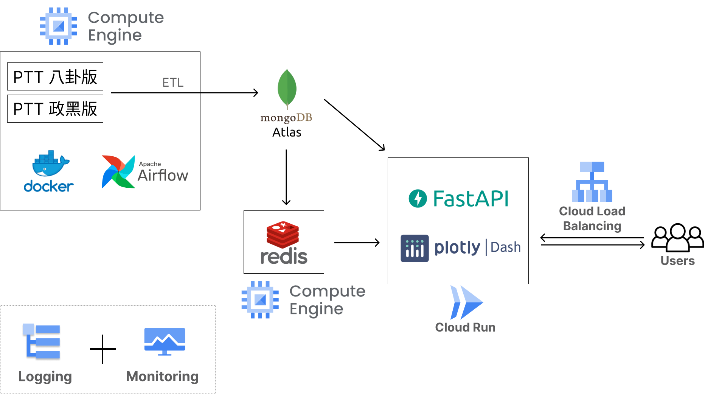

# Comment-Detector

## Question:
- Are there any cyber warriors (網軍) or individuals manipulating public opinions (帶風向) on Taiwan's forums?
- Can they be detected? 
- Can I provide information to users to help them form their own judgments?
- Apart from IP addresses, which are widely used but influenced by various factors, are there other methods or perspectives that can be used?

## Objective:
- Identify alternative methods to detect cyber warriors and those manipulating public opinions.
- Analyze data and offer objective information to users, enabling them to form their own judgments.
- Ultimately, enhance the information-receiving experience for users.

## Approaches:
1. Focus primarily on PTT (Taiwan's largest forum):
   1. Gossiping, which has the largest number of users.
   2. HatePolitics, which is highly related to politics.
2. Gather and cleanse articles and comments.
3. Analyze data using metrics like keywords, concurrency, and word clouds to obtain deeper insights.
4. Visualize the findings with graphs and tables.
5. Offer APIs for interested parties.

## Architecture


## Data
### Source
- PTT - Gossiping
- PTT - HatePolitics

### ETL
- Extract: web crawling (requests + beautifulsoup)
- Transform: python
- Load: MongoDB


## Tools and Techniques
### <u>Database: MongoDB</u>
#### Objective: 
#### Why use this?

## <u>Schedule: Airflow</u>
### Objective: 
### Why use this?

## <u>CDC: Kafka</u>
### Objective: 
### Why use this?
### Steps:
1. downloading from [Kafka edu](https://github.com/mongodb-university/kafka-edu.git)
2. running docker: ```docker-compose -p mongo-kafka up -d --force-recreate```
3. adding connectors: ```docker exec -it mongo1 /bin/bash```
4. creating connector.json: ```nano simplesource.json```
   ```json
   {
     "name": "mongo-simple-source",
     "config": {
       "connector.class": "com.mongodb.kafka.connect.MongoSourceConnector",
       "connection.uri": "mongodb://mongo1",
       "database": "Tutorial1",
       "collection": "orders"
     }
   }
   ```
5. connecting: ```cx simplesource.json```

### Reference:
1. [MongoDB Quickstart](https://www.mongodb.com/docs/kafka-connector/current/quick-start/)
2. [Kafka Connector Tutorial Setup](https://www.mongodb.com/docs/kafka-connector/current/tutorials/tutorial-setup/#std-label-kafka-tutorials-docker-setup)
3. [Getting Started with the MongoDB Kafka Source Connector](https://www.mongodb.com/docs/kafka-connector/master/tutorials/source-connector/)


## <u>Dashboard: Plotly Dash</u>
### Objective: 
1. Create interactive interface for users to explore this product
2. Create dashboards to demonstrate the product
### URL: http://3.106.78.149:8000/
### Why use this?

## <u>Middleware - WSGI (Web Server Gateway Interface) server: gunicorn</u>
### Objective: 
### Why use this?

## <u>Middleware - ASGI (Asynchronous Server Gateway Interface) server: uvicorn</u>
### Objective: 
### Why use this?

## <u>Process manager: pm2</u>
### Objective: managing the process of streamlit
### Why use this?
1. Dashboards needs to be available for users.
2. Currently, streamlit does not support running with gunicorn.
### Steps:
1. installation: ```sudo apt install npm```
2. installation: ```sudo npm install pm2 -g```
3. creating .sh: ```vim start_streamlit.sh```
    ```shell
    #!/bin/bash
    gunicorn main:app -w 4 -k uvicorn.workers.UvicornWorker
    ```
4. changing .sh permission: ```chmod +x start_streamlit.sh```
5. starting virtual env: ```source ./crawler/bin/activate```
6. running script:```pm2 start start_streamlit.sh```

## <u>API: FastAPI</u>
### Objective: 
### Why use this?

## <u>Cache: Redis</u>
### Objective: 
### Why use this?

## <u>Rate limiter: FastAPI</u>
### Objective: 
### Why use this?
