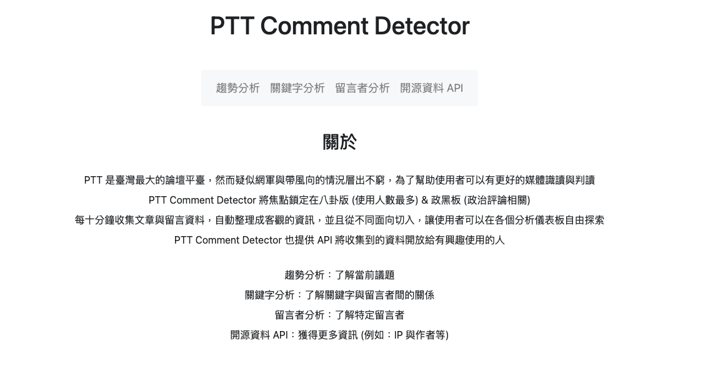
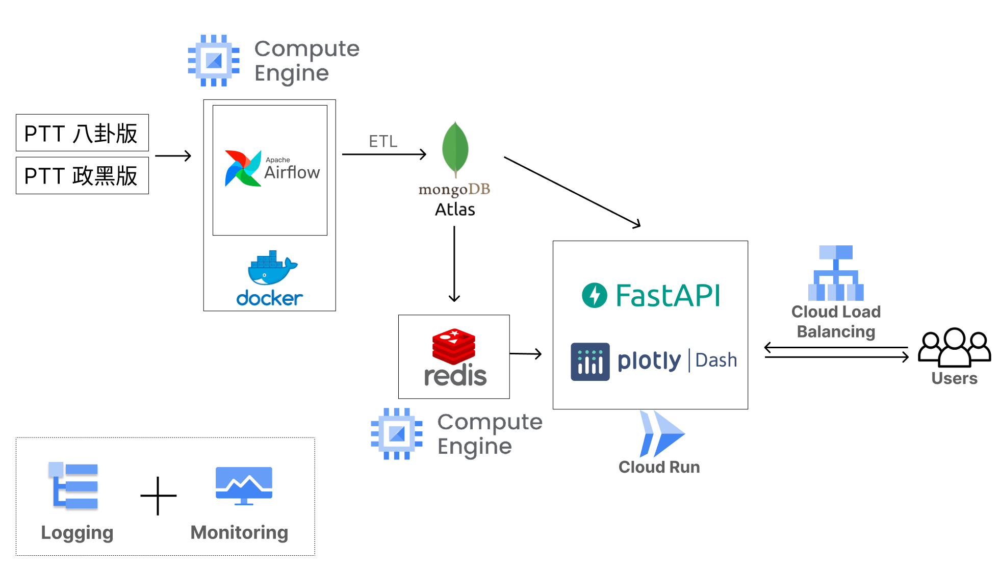
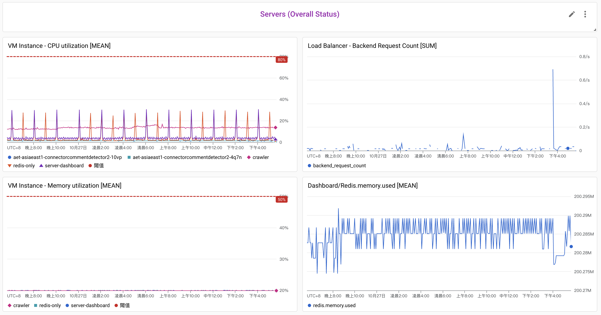
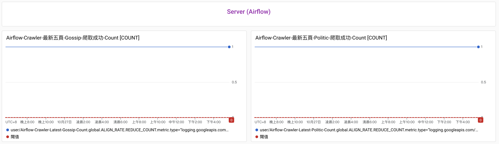
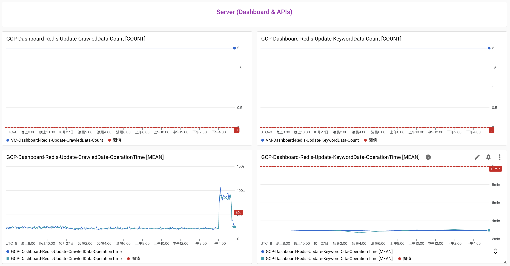
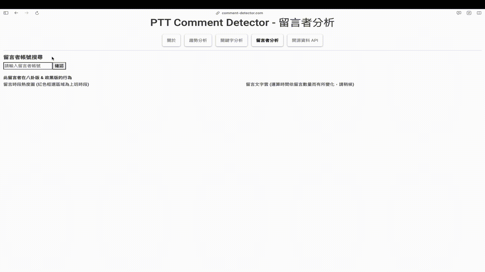

# Comment-Detector

## Table of Contents
* [Introduction](#Introduction)
* [Architecture](#Architecture)
* [Data](#Data)
* [Tools](#Tools)
* [Monitoring](#Monitoring)
* [Clip](#Clip)
* [Contact](#Contact)

## Introduction
#### A dashboard offering users comprehensive & insightful data about PTT (Taiwan's largest forum)
#### Users can form judgment about cyber warriors (網軍) and people manipulating public opinions (帶風向) 
#### Platform: [https://comment-detector.com](https://comment-detector.com)

## Architecture

### Compute Engine #1:
- Aim 1: Executing web crawling every 10 minute orchestrated by Apache Airflow on Docker
- Aim 2: Cleaning and extracting data 
- On: GCP Compute Engine

### Compute Engine #2:
- Aim: Deploying Redis as cache system storing data updated by Python scripts scheduled by APScheduler
- On: GCP Compute Engine

### Database
- Aim: Storing cleaned data and providing data for platform
- On: MongoDB Atlas

### Dashboard (Application)
- Aim: Retrieving data from MongoDB and demonstrating organized data for users
- On: image managed by Cloud Run 

## Data
### Source
- PTT - Gossiping which has the largest number of users.
- PTT - HatePolitics which is highly related to politics.

### ETL
- Extract: web crawling (requests + Beautiful Soup)
- Transform: python (data cleaning and extraction)
- Load: MongoDB

## Tools
| Category       | Tool/Technique                  |
|----------------|---------------------------------|
| Database       | MongoDB                         |
| Data Pipeline  | Airflow                         |
| Dashboard      | Plotly Dash                     |
| Backend        | FastAPI                         |
| Cache system   | Redis                           |
| Autoscaling    | Cloud Run                       |
| Load Balancing | Cloud Load Balancing            |
| Monitoring     | Cloud Monitoring, Cloud Logging |
| Others         | GCP Compute Engine              |

## Monitoring
#### Overall
- 
#### Airflow
- 
#### Dashboard
- 

## Clip
#### 趨勢分析
- 
#### 關鍵字分析
- 
#### 留言者分析
- 
#### APIs
- 

## Contact
Raymond Hung kirk336neo@gmail.com
